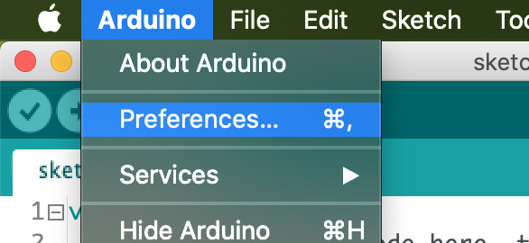

# Arduino IDE and ESP32

It's possible to use the [Arduino IDE](https://www.arduino.cc/en/main/software) to program the ESP32.  

Here we will give more info how to do it. (!! on MacOs)  
1. start the Arduino IDE  
2. click the '**Arduino**' menu and click the '**Preferences**' option  

4. set the following link https://dl.espressif.com/dl/package_esp32_index.json in the field '**Additional Boards Manager URLs**'
5. click the '**OK**' button
