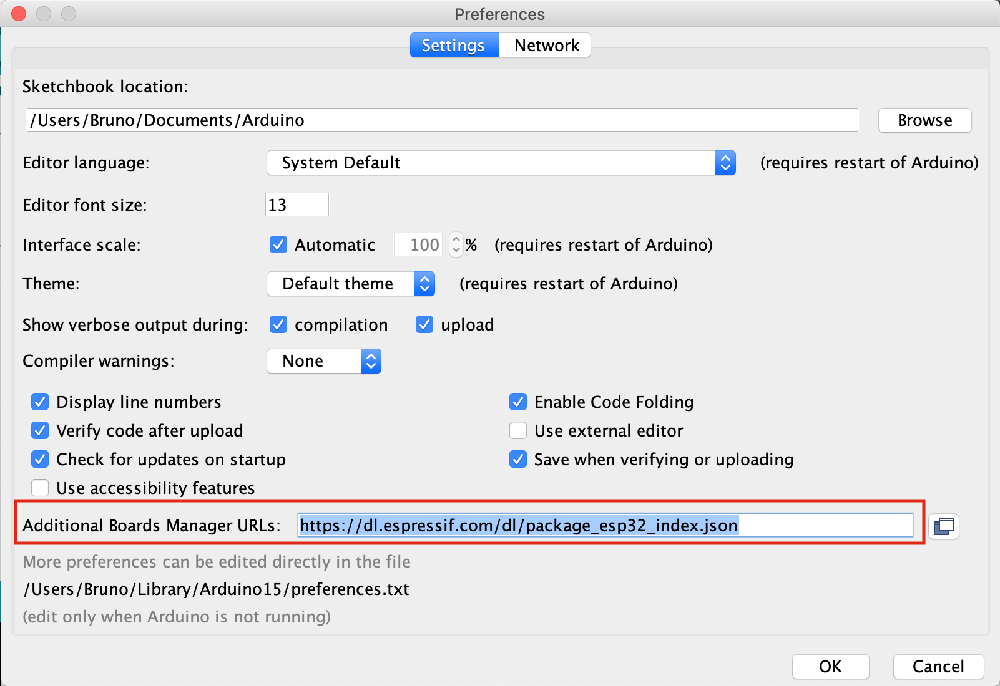
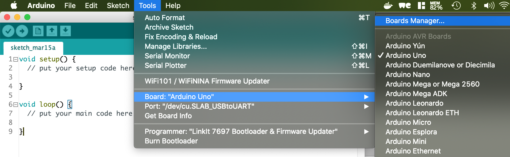
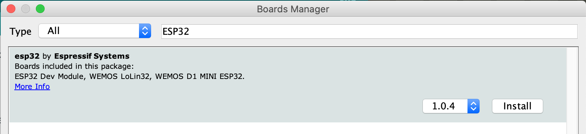

# Arduino IDE and ESP32

It's possible to use the [Arduino IDE](https://www.arduino.cc/en/main/software) to program the ESP32.  

Here we will give more info how to do it. (!! on MacOs)  
1. start the Arduino IDE  
2. click the '**Arduino**' -> '**Preferences**' option  
  
4. set the following link `https://dl.espressif.com/dl/package_esp32_index.json` in the field '**Additional Boards Manager URLs**'
5. click the '**OK**' button    
6. click the **Tools** -> **Board** -> **Boards Manager** option    
7. install now the following package   
8. close the window  

Now everything is installed and you can start to program you ESP32
